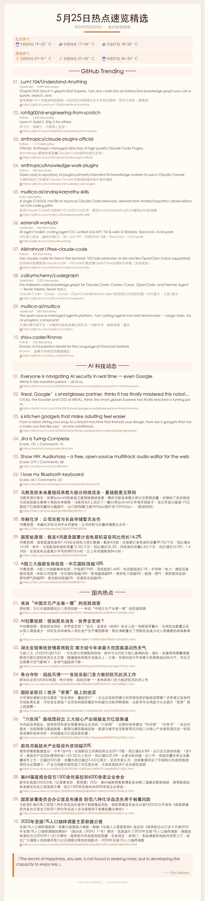

<div align="left">

<details>

<summary>🌐 Language | 语言</summary>

<div>

<div align="center">

[English](#english) | [简体中文](#)

</div>

</div>

</details>

</div>

<p align="center">

<b><big>生成暖色调每日新闻简报卡片的 Agent Skill</big></b><br/>

<a href="references/DESIGN_SPEC.md">📖 设计文档</a> · <a href="SKILL.md">📋 Skill 定义</a> · <a href="#安装">⚡ 快速安装</a>

</p>

> 推荐必读：[DESIGN_SPEC.md](references/DESIGN_SPEC.md) — 卡片视觉设计、内容结构、数据源详解。




* * *

## v2.0 —— Agent Skills SPEC 标准

经过 [Agent Skills SPEC](https://agentskills.io/specification) 标准化改造，daily-news-briefing 是一个自包含、平台无关的通用 Skill。定时调度和消息推送由外部 Agent 负责，Skill 只专注于内容生成。

| 能力 | 说明 |
|------|------|
| 多城市天气 | Open-Meteo 免费 API，WMO 天气代码配 PIL 手绘图标，支持 N 天预报 |
| GitHub Trending | 网页抓取 + MyMemory 中文翻译，语言/星标标签，Top N 可配置 |
| AI 科技动态 | 多源融合：RSS（TechCrunch、The Verge）+ Hacker News API + 36氪，描述优先 |
| 国内热点 | 新华社、人民网逐篇文章抓取，meta description + 首段兜底提取正文 |
| 每日名言 | ZenQuotes API 每日动态获取，失败自动回退到 ~20 条静态精选库 |
| PIL 卡片渲染 | 纯 Python，零浏览器依赖，动态高度裁剪，暖色调完整色板 |
| 实时补采 | JSON 数据不足时，三板块自动从在线源补采至 `display_count` 配置数量 |
| 跨平台字体 | 内置 Noto Sans SC（SIL OFL 开源），macOS STHeiti 优先，自动降级 |
| 数据溯源 | 每日源数据按日期命名留存（`news_input_YYYY-MM-DD.json`） |

<details>
<summary>v1.0 更新记录</summary>

**v1.0** —— 初始版本：暖色调卡片设计，Open-Meteo 天气，三大新闻板块，名言静态库，PIL + CDP 双渲染器。

</details>

## 安装

### 方式一：让 Agent 自动安装

```
帮我安装 daily-news-briefing skill：https://github.com/byctor/daily-news-briefing
```

### 方式二：手动安装

```bash
# 克隆到 Claude Code skills 目录
git clone https://github.com/byctor/daily-news-briefing.git ~/.claude/skills/daily-news-briefing

# 安装 Python 依赖
pip install -r ~/.claude/skills/daily-news-briefing/requirements.txt
```

依赖：`Pillow` `requests` `beautifulsoup4`，Python 3.9+。

## 使用

安装后在对话中告诉 Agent：

```
生成今日新闻简报
```

Agent 会运行 `python scripts/generate.py`，输出：

```
output/
├── images/2026-05-25.png              # 卡片图片（主要产物）
├── daily/2026-05-25.md                # Markdown 版本
├── daily/2026-05-25.html              # HTML 版本
├── data/news_input_2026-05-25.json    # 源数据（按日留存）
└── briefing-summary.md                # 滚动汇总（带日期索引）
```

## 配置

编辑 `config/settings.py`，所有可调参数集中管理，无需改业务代码：

| 配置块 | 可调内容 |
|--------|----------|
| `WEATHER` | 城市列表（纬度/经度/时区）、预报天数 |
| `GITHUB_TRENDING` | 展示数量、抓取地址、描述截断长度 |
| `AI_NEWS` | 展示数量、新闻源列表 |
| `DOMESTIC_NEWS` | 展示数量、新闻源列表 |
| `CARD` | 卡片宽度、边距、内边距 |
| `COLORS` | 完整色板（背景、卡片、强调色、文字等） |
| `FONTS` | 字体路径、各文本元素字号 |
| `QUOTE_API` | API 开关、超时时间 |
| `QUOTES` | 静态名言库（可增删） |

[assets/config.template.py](assets/config.template.py) 提供了一套最简配置模板，可复制到 `config/settings.py` 快速起步。

## 定时调度 —— 配合 cc-connect 外部 Agent

Skill 本身不包含定时调度逻辑。以下是使用 [cc-connect](https://github.com/chenhg5/cc-connect)（开源消息桥接工具，支持微信/飞书/Telegram 等多平台）实现每日 9:00 自动生成并推送的完整示例。

### 1. 安装 cc-connect

```bash
npm install -g cc-connect
```

### 2. 创建定时任务

```bash
cc-connect cron add \
  --cron "0 9 * * *" \
  --prompt "运行 daily-news-briefing skill 生成今日简报：cd ~/.claude/skills/daily-news-briefing && python3 scripts/generate.py && cc-connect send --image ~/.claude/skills/daily-news-briefing/output/images/\$(date +%Y-%m-%d).png" \
  --desc "每日新闻简报 9:00" \
  --session-mode new-per-run \
  --durable true
```

### 3. 参数说明

| 参数 | 说明 |
|------|------|
| `--cron "0 9 * * *"` | 北京时间每日 9:00（cc-connect 使用本地时区） |
| `--prompt` | 定时触发的任务内容：进入 skill 目录 → 运行生成 → 发送卡片 |
| `--session-mode new-per-run` | 每次触发创建全新会话，避免上下文污染 |
| `--durable true` | 持久化存储，cc-connect 重启后任务不丢失 |

### 4. 管理定时任务

```bash
cc-connect cron list          # 查看所有定时任务
cc-connect cron info <id>     # 查看任务详情
cc-connect cron del <id>      # 删除任务
```

> **提示**：cc-connect 开源地址 [github.com/chenhg5/cc-connect](https://github.com/chenhg5/cc-connect)，支持微信、飞书、Telegram、Slack、Discord 等多平台。上述示例基于微信通道，其他平台用法相同。

## 架构

```
scripts/
├── generate.py       # 编排器：抓取 → 补采 → 渲染 → 保存
├── render_card.py    # PIL 卡片渲染器（动态高度，无浏览器依赖）
└── emoji_icons.py    # PIL 手绘天气/Emoji 图标（无外部图片）
```

流水线：
1. 获取所有城市天气（Open-Meteo）
2. 加载 `output/data/news_input.json`（如外部 Agent 已预采集）
3. 不足时从在线源实时补采
4. 获取每日名言（API → 静态库兜底）
5. 生成 Markdown、HTML、PIL PNG 卡片
6. 更新滚动汇总文件

## 设计哲学

> Skill = 配置 + 脚本 + 资源。不含定时调度，不含消息推送——那些属于外部 Agent 的职责。保持 Skill 自包含、平台无关。

详见 [SKILL.md](SKILL.md) 的完整 Skill 定义和 [DESIGN_SPEC.md](references/DESIGN_SPEC.md) 的视觉设计规范。

## License

MIT · 作者：[byctor](https://github.com/byctor)

* * *

<div id="english"></div>

## English

A warm-toned daily news briefing card generator — multi-city weather, GitHub Trending, AI/tech news, domestic China news, and inspirational quotes. Built as an [Agent Skills SPEC](https://agentskills.io/specification) compliant skill.

**Give your AI agent the ability to generate beautiful daily news digests.**

### Installation

**Option 1 — Let your agent install:**

```
Install the daily-news-briefing skill: https://github.com/byctor/daily-news-briefing
```

**Option 2 — Manual:**

```bash
git clone https://github.com/byctor/daily-news-briefing.git ~/.claude/skills/daily-news-briefing
pip install -r ~/.claude/skills/daily-news-briefing/requirements.txt
```

### Capabilities

| Capability | Description |
|-----------|-------------|
| Multi-city Weather | Open-Meteo API, WMO codes with PIL-drawn icons, configurable days |
| GitHub Trending | Web scraping + Chinese translation, language/stars tags |
| AI/Tech News | Multi-source: RSS + Hacker News API + Chinese tech sites |
| Domestic News | Xinhuanet & People's Daily article scraping |
| Daily Quote | ZenQuotes API with static fallback |
| PIL Rendering | Pure Python, no browser, dynamic height, warm palette |
| Live Supplement | Auto-fills from live sources when JSON data is insufficient |
| Cross-platform | Bundled Noto Sans SC font, macOS priority, auto fallback |

### Quick Start

```bash
pip install -r requirements.txt
python scripts/generate.py
```

### Scheduling with cc-connect

This skill has no built-in scheduler. Use [cc-connect](https://github.com/chenhg5/cc-connect) (open-source messaging bridge) as the external agent to schedule daily generation:

```bash
npm install -g cc-connect

cc-connect cron add \
  --cron "0 9 * * *" \
  --prompt "Run daily-news-briefing: cd ~/.claude/skills/daily-news-briefing && python3 scripts/generate.py && cc-connect send --image ~/.claude/skills/daily-news-briefing/output/images/\$(date +%Y-%m-%d).png" \
  --desc "Daily News Briefing 9:00" \
  --session-mode new-per-run \
  --durable true
```

See the [Chinese section](#) above for detailed parameter explanations.

### License

MIT · Author: [byctor](https://github.com/byctor)
